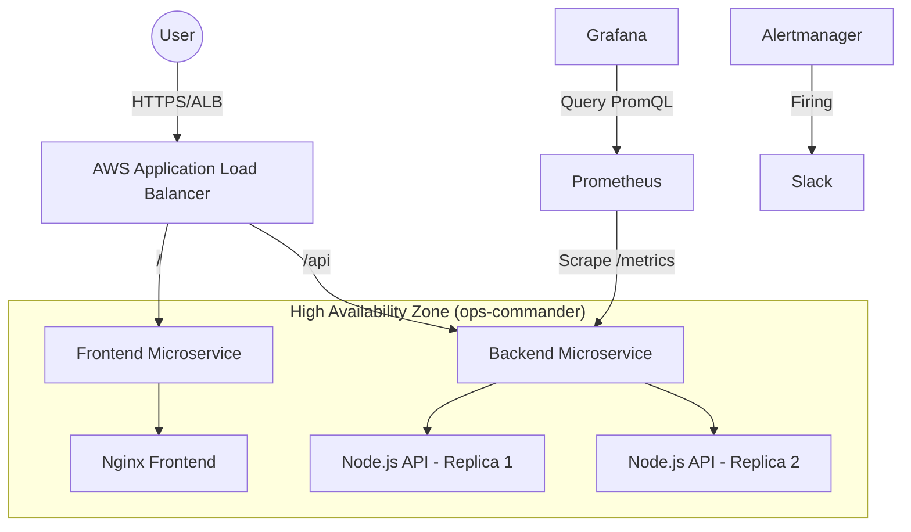

# 🛡️ Ops Commander: High-Availability Microservices & Observability Platform

**Ops Commander** is a production-grade **Microservices** application designed to demonstrate **Site Reliability & DevOps & Cloud Engineering (** practices on **Amazon EKS**.

This platform focuses on maintaining **Zero Downtime** and **High Availability (HA)** during chaotic failure scenarios. It features a comprehensive **Observability Stack** (Prometheus & Grafana) that provides deep insights into system saturation, error rates, and automated recovery metrics.

---

## 🏛️ Architecture & Reliability

The system is built on a decoupled microservices architecture designed for resilience:



1. 🔭 Deep Observability & Monitoring
The core of this project is a production-ready monitoring stack designed to eliminate "blind spots" in operations.

Grafana SRE Dashboard: A custom-built "Single Pane of Glass" visualizing the USE Method (Utilization, Saturation, Errors).

Ephemeral Metric Handling: Solves the "Ghost Pod" problem (data loss when pods die) by using persistent sum(increase()) PromQL aggregations.

Business Logic Monitoring: Custom Prometheus exporters track application-specific states (Chaos Kills, Stress Mode) alongside infrastructure metrics.

Alerting: Proactive Alertmanager rules for high latency and saturation events.

2. ⚡ High Availability & Zero Downtime
Replica Redundancy: The Backend Microservice runs multiple replicas to ensure that if the Chaos Monkey kills one pod, the service remains available to users (Zero Downtime).

Self-Healing: Leverages Kubernetes Liveness/Readiness probes to automatically detect and replace failed components without manual intervention.

Sticky Sessions: Uses AWS ALB Cookies to maintain user state consistency across distributed replicas.

3. 🛡️ Security & Microservices
Decoupled Architecture: Strict separation between the Nginx Frontend and Node.js Backend services.

Least Privilege: Custom AWS IAM policies allow the ALB Controller to manage VPC resources securely.

Network Isolation: Ingress rules strictly define traffic paths (/ vs /api), minimizing the attack surface.

# 📂 Project Structure
```
ops-commander/
├── backend/               # Backend Microservice (Chaos Engine)
├── frontend/              # Frontend Microservice (Nginx UI)
├── monitoring/            # Grafana Dashboards, Prometheus ServiceMonitors & Alerting
└── security/              # IAM Policies, RBAC, & Ingress Rules
```
# 🚀 Deployment Guide

Prerequisites:
+ Amazon EKS Cluster running.
+ AWS Load Balancer Controller installed.
+ Prometheus Operator (kube-prometheus-stack) installed.

1. security
kubectl apply -f security/rbac.yaml

2. Deploy Microservices
Deploy the separate Frontend and Backend tiers.
+ Backend Microservice (API + Chaos Logic)
kubectl apply -f backend/deployment.yaml
+ Frontend Microservice (UI)
kubectl apply -f frontend/deployment.yaml

3. Configure Networking (Ingress)
This provisions the AWS Application Load Balancer with sticky sessions enabled for HA.
kubectl apply -f security/ingress.yaml
Wait 2-3 minutes for the AWS ALB to provision. URL via: kubectl get ingress -n ops-commander

4. Enable Observability
Tell Prometheus to scrape the custom metrics and import the dashboard.
kubectl apply -f monitoring/service-monitor.yaml
kubectl apply -f monitoring/alerting-rules.yaml.
kubectl apply -f alertmanager.yaml (after you're own configuration)

# 🎮 Scenarios (Demo)

Scenario A: Resilience & High Availability

1- Open the Ops Commander UI.
2- Click "KILL RANDOM POD" (Chaos Monkey).
3- Observation:
    + Zero Downtime: The UI remains responsive because traffic is instantly routed to healthy replicas.
    + Observability: Grafana captures the "Kill Event" instantly, and the "Active Replicas" graph shows the automatic recovery.

Scenario B: Load & Saturation Analysis

1- Click "ACTIVATE LOAD".
2- Observation:
    + Grafana "Stress Status" turns RED.
    + Saturation Metrics: CPU usage spikes are visualized per-pod.
    + Alertmanager: Triggers a "HighLoad" alert to Slack, demonstrating proactive monitoring.

# 🛠️ Tech Stack

+ Cloud: Amazon EKS
+ Orchestration: Kubernetes
+ Observability: Prometheus, Grafana, Alertmanager
+ Architecture: Microservices (Node.js, Nginx)
+ Networking: AWS ALB Ingress Controller


Built with Love by Soulayman Jazouli as a demonstration of modern Cloud Native practices 
